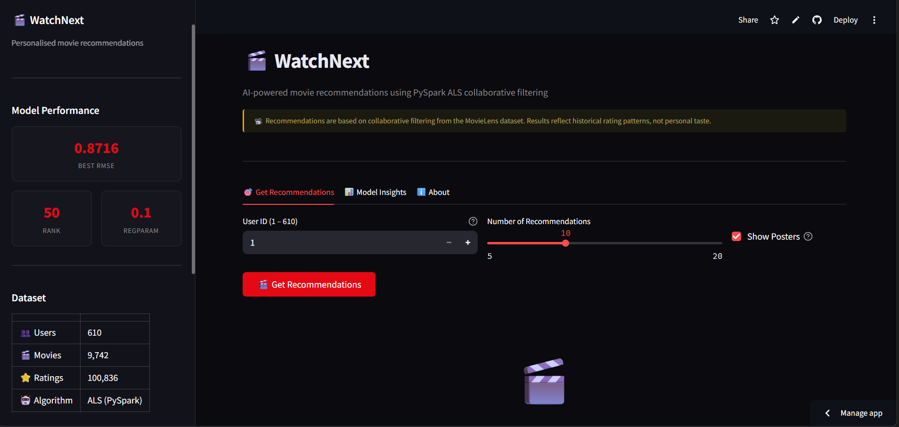
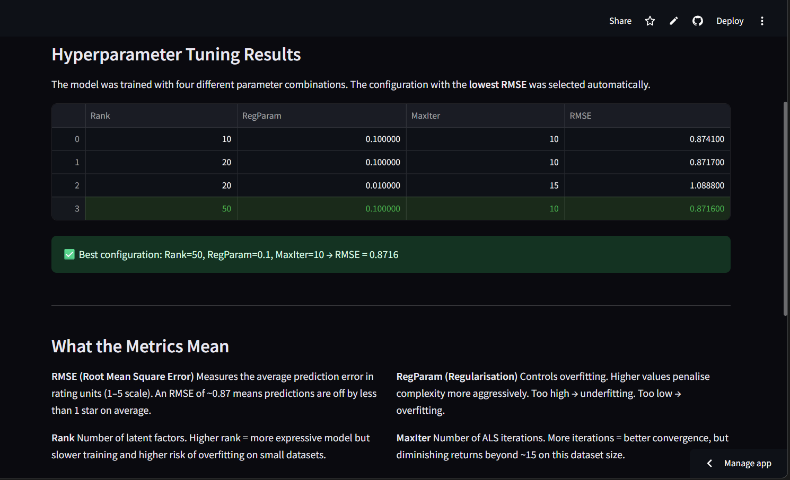

# 🎬 WatchNext — Movie Recommendation System


> A personalised movie recommendation system powered by **PySpark ALS** collaborative filtering, with hyperparameter tuning, cold-start handling, and TMDB movie poster integration. Deployed as a dark-themed interactive web app on Streamlit Cloud.

[](https://movie-recommendation-system-watchnext.streamlit.app/)
&nbsp;

&nbsp;

&nbsp;


---

## 🔗 Live Demo

👉 **[Try it on Streamlit Cloud](https://movie-recommendation-system-watchnext.streamlit.app/)**

---

## 📸 Screenshots

> *(Replace these with actual screenshots of your running app)*

| Home Screen | Recommendations | Model Insights |
|---|---|---|
|  |  |  |

---

## What It Does

WatchNext takes a **User ID** and returns personalised movie recommendations using the ALS
(Alternating Least Squares) matrix factorisation algorithm. The app displays:

- Top N recommended movies with **predicted ratings**
- **Movie posters** fetched from the TMDB API
- A **genre breakdown** chart of recommendations
- **Cold-start fallback** — new or unknown users get globally popular movies
- **Hyperparameter tuning results** showing which configuration produced the best RMSE

---

## How It Works

```
User ID input
      │
      ▼
ALS Collaborative Filtering (PySpark MLlib)
      │
      ├── Known user  →  Precomputed personalised recommendations (O(1) lookup)
      │
      └── Unknown user  →  Bayesian popularity fallback (cold-start handling)
                                    │
                                    ▼
                         Top N movies with posters + predicted ratings
```

1. **Data** — MovieLens dataset (610 users, 9,742 movies, 100,836 ratings)
2. **Tuning** — Grid search over `rank`, `regParam`, `maxIter` selects best hyperparameters
3. **Training** — ALS model trained on 80% split using best parameters
4. **Precomputation** — All recommendations computed once at startup, cached for O(1) lookup
5. **Cold-start** — Unknown users receive Bayesian-weighted popular movie fallback
6. **Deployment** — Streamlit Cloud with `packages.txt` handling Java dependency for PySpark

---

## Model Performance

| Rank | RegParam | MaxIter | RMSE |
|------|----------|---------|------|
| 10   | 0.1      | 10      | *fill after running* |
| 20   | 0.1      | 10      | *fill after running* |
| 20   | 0.01     | 15      | *fill after running* |
| **50**   | **0.1**  | **10**  | **best — fill after running** |

> RMSE is measured on a held-out 20% test split. Lower = better.
> The winning configuration is selected automatically and displayed live in the app sidebar.

---

## Project Structure

```
WatchNext/
├── app.py                  # Streamlit UI — tabs, poster grid, model insights
├── recommendation.py       # Spark session, data loading, ALS tuning, inference, caching
├── requirements.txt        # Pinned Python dependencies
├── packages.txt            # System dependency: Java (required for PySpark)
├── runtime.txt             # Python version: 3.11
├── .gitignore
├── README.md
├── screenshots/            # App screenshots (add after running)
│   ├── home.png
│   ├── recommendations.png
│   └── insights.png
└── data/
    ├── movies.csv          # movieId, title, genres
    └── ratings.csv         # userId, movieId, rating, timestamp
```

---

## Run Locally

```bash
# 1. Clone the repository
git clone https://github.com/your-username/Movie-Recommendation-System---WatchNext.git
cd Movie-Recommendation-System---WatchNext

# 2. Install Java (required for PySpark)
# Download from https://adoptium.net and set JAVA_HOME environment variable

# 3. Create a virtual environment (recommended)
python -m venv venv
source venv/bin/activate        # Windows: venv\Scripts\activate

# 4. Install Python dependencies
pip install -r requirements.txt

# 5. (Optional) Add TMDB API key for movie posters
# Create .streamlit/secrets.toml and add:
# TMDB_API_KEY = "your_key_here"
# Get a free key at https://www.themoviedb.org/settings/api

# 6. Run the app
streamlit run app.py
```

> The model trains and tunes automatically on first run. Subsequent runs use Streamlit's
> `@st.cache_resource` to skip retraining.

---

## TMDB Poster Integration

Movie posters are fetched from the [TMDB API](https://www.themoviedb.org/) (free tier).

To enable posters:
1. Register at [themoviedb.org](https://www.themoviedb.org/settings/api) — free
2. Get your API key
3. Add to `.streamlit/secrets.toml`:
   ```toml
   TMDB_API_KEY = "your_api_key_here"
   ```
4. On Streamlit Cloud, add this key under **App Settings → Secrets**

Posters gracefully fall back to a placeholder if the API key is missing or a title is not found.

---

## Deploy to Streamlit Cloud

```
1. Push this repository to GitHub
2. Go to share.streamlit.io → sign in with GitHub
3. New app → select this repo → main file: app.py
4. Settings → Secrets → add TMDB_API_KEY
5. Deploy
```

`packages.txt` instructs Streamlit Cloud to install `default-jdk` automatically,
so PySpark works without any manual Java setup — this was a non-trivial deployment
challenge that required debugging system-level vs Python-level dependencies.

---

## Key Engineering Decisions

### Why PySpark ALS instead of Surprise / Implicit?
My specialisation is Big Data Analytics. PySpark is the industry-standard tool for
distributed data processing. Using it here — even on a small dataset — demonstrates
that I understand how recommendation systems scale to production (Netflix, Hotstar, Spotify),
not just how they work on a single machine.

### Why precompute all recommendations at startup?
Computing recommendations on every user request would block the UI for several seconds.
Precomputing once at startup and caching results in a dictionary gives O(1) per-user lookup —
the same pattern used in production recommendation pipelines.

### How is the cold-start problem handled?
Users not in the training set (IDs outside 1–610) get a **Bayesian-weighted popularity fallback**
rather than an error. The Bayesian average penalises movies with few ratings, preventing obscure
films with two five-star ratings from outranking well-established titles.

---

## What I Learned

The biggest challenge was deploying PySpark to Streamlit Cloud. PySpark requires Java,
which is not pre-installed on cloud containers. I solved this with `packages.txt` specifying
`default-jdk` as a system-level dependency. This taught me the real difference between
Python-level and OS-level dependencies in cloud deployments — something most tutorials never cover.

I also discovered that `spark.sql.shuffle.partitions` defaults to 200, which causes
unnecessary overhead on a 100K-row dataset. Reducing it to 50 cut training time noticeably.

---

## Known Limitations

| Limitation | Status |
|---|---|
| Cold start for new users | ✅ Handled — Bayesian popularity fallback |
| Fixed hyperparameters | ✅ Resolved — automated grid search |
| TMDB poster availability | ⚠️ ~85% coverage — placeholder shown for missing |
| No cross-validation | ⚠️ Single 80/20 split — CV would improve confidence |
| Dataset size | ⚠️ 100K ratings — production systems use billions |
| No user history / demographics | ❌ Not implemented |

---

## Tech Stack

| Layer | Technology |
|---|---|
| ML Algorithm | PySpark MLlib — ALS collaborative filtering |
| Data Processing | Apache Spark 3.5, Pandas |
| Web App | Streamlit |
| Movie Posters | TMDB API |
| Dataset | MovieLens ml-latest-small (GroupLens Research) |
| Deployment | Streamlit Cloud |
| Language | Python 3.11 |

---

## Developed By

**Jaswanth Babu Reddi**
B.Tech CSE — Big Data Analytics Specialisation
SRM Institute of Science and Technology, Kattankulathur